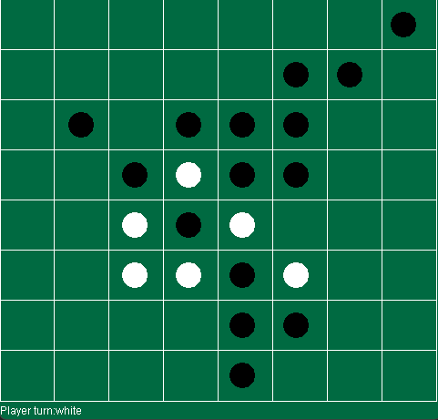

# Othello Game

A classic Othello (Reversi) board game implementation in Java with a graphical user interface built using Java Swing. This project features a clean architecture with configurable game settings and an intuitive GUI for two-player gameplay.

## 📋 Description

Othello is a strategy board game for two players, played on an 8×8 board. Players take turns placing discs on the board with their assigned color facing up. The objective is to have the majority of discs turned to display your color when the last playable empty square is filled.

This implementation includes:
- Classic Othello game rules
- Turn-based gameplay for two players (Black and White)
- Automatic piece flipping based on game rules
- Visual board representation with real-time updates
- Score tracking and winner determination
- Skip turn when no valid moves are available

## ✨ Features

- **Interactive GUI**: Clean and intuitive graphical interface with mouse-click controls
- **Game Logic**: Full implementation of Othello rules including:
  - Valid move detection in all 8 directions
  - Automatic piece flipping when capturing opponent pieces
  - Turn skipping when no valid moves exist
  - Game end detection when neither player can move
- **Configurable Settings**: Easily modify board size, window dimensions, and display text through configuration file
- **Singleton Pattern**: Efficient board state management using singleton design pattern
- **Real-time Score Display**: Shows current player turn and final scores

## 🚀 Getting Started

### Prerequisites

- Java Development Kit (JDK) 8 or higher
- Any Java IDE (IntelliJ IDEA, Eclipse, NetBeans) or command line tools

### Installation

1. Clone the repository:
```bash
git clone https://github.com/koushamoeini/othello.git
cd othello
```

2. Compile the project:
```bash
javac -d out src/Main.java src/Configs/*.java src/Game/*.java src/GameObjects/*.java src/Gui/*.java
```

3. Run the game:
```bash
java -cp out Main
```

## 🎮 How to Play

1. Launch the application - a game window will appear with the initial board setup
2. The game starts with 4 pieces in the center (2 black, 2 white)
3. Black player moves first
4. Click on any valid empty cell to place your piece
5. Valid moves must flip at least one opponent piece by trapping them between your pieces
6. If you have no valid moves, your turn is automatically skipped
7. The game ends when neither player can make a move
8. The player with the most pieces on the board wins!

### Game Rules

- You must place a piece so that an opponent's piece (or row of pieces) is flanked by your pieces
- All flanked opponent pieces are flipped to your color
- You can flip pieces horizontally, vertically, or diagonally
- You must make a move if you have any valid moves available
- If you have no valid moves, your turn is skipped

## ⚙️ Configuration

The game settings can be modified in `src/Configs/Config`:

```properties
rowCount = 8              # Number of rows on the board
colCount = 8              # Number of columns on the board
windowWidth = 500         # Window width in pixels
windowHeight = 500        # Window height in pixels
turn = Player turn:       # Turn display text
player1Win = Winner: Player 1
player2Win = Winner: Player 2
Tie = tie
White = white
Black = black
```

## 🏗️ Project Structure

```
othello/
├── src/
│   ├── Main.java                 # Application entry point
│   ├── Configs/
│   │   ├── Config                # Configuration properties file
│   │   └── Config.java           # Configuration reader class
│   ├── Game/
│   │   └── Logic.java            # Core game logic and rules
│   ├── GameObjects/
│   │   ├── Board.java            # Board state management (Singleton)
│   │   └── Piece.java            # Piece data model
│   └── Gui/
│       └── MyPanel.java          # GUI panel with rendering and input
├── .gitignore
├── LICENSE
└── README.md
```

## 🛠️ Technologies Used

- **Java SE**: Core programming language
- **Java Swing**: GUI framework for the game interface
- **Java AWT**: Graphics and event handling
- **Properties**: Configuration file management

## 📸 Screenshots



The game features a classic green board with black and white pieces, a clean grid layout, and status text showing the current player's turn and final game results.

## 🎯 Future Enhancements

Potential improvements for future versions:
- AI opponent with different difficulty levels
- Move hints for beginners
- Undo/Redo functionality
- Game history and replay
- Custom themes and piece designs
- Save/Load game state
- Online multiplayer support
- Animation effects for piece flipping

## 📝 License

This project is licensed under the MIT License - see the [LICENSE](LICENSE) file for details.

## 👤 Author

**Kousha Moeini**
- Email: koushamoeini@gmail.com
- GitHub: [@koushamoeini](https://github.com/koushamoeini)

---
